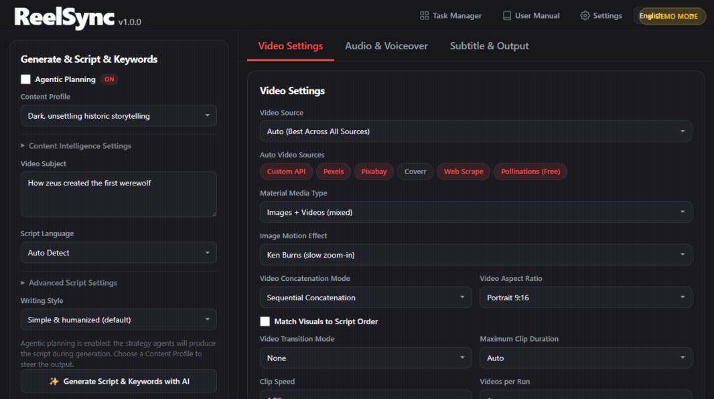

# ReelSync

[简体中文](README.zh.md)

<p align="center">
  
</p>

ReelSync is a tool for generating short videos from a topic or a script. You give it a subject, and it writes the script, pulls matching footage, adds subtitles and background music, and renders an HD video.

This project started as a fork of [MoneyPrinterTurbo](https://github.com/harry0703/MoneyPrinterTurbo) by [harry0703](https://github.com/harry0703). It's our own version: we kept the solid foundation and added the features we wanted. Full attribution below.

---

## Interactive demo

A fully self-contained, interactive product simulation ships with the repo — no backend or API keys needed. It walks the whole workflow (dashboard → project creation → AI production pipeline with research, script, scenes, assets, voice, assembly and render → finished video workspace with playback and export) using mocked data.

```bash
# open demo/index.html in any browser, or serve it:
python -m http.server 8080 --directory demo
# then visit http://localhost:8080
```

Append `?record=1` for the deterministic recording mode (auto-executes the workflow at a fixed 16:9 viewport with demo controls hidden). `docs/reelsync-demo.gif` above is generated from that mode via `scripts/record_demo.py`.

## What it does

A typical run looks like this:

1. You enter a **video subject** (or paste a ready-made script).
2. An LLM (optional) writes the script and suggests search keywords.
3. ReelSync downloads footage from video providers, ranks it, and stitches it into a timeline.
4. A voiceover is generated from the script.
5. Subtitles are rendered from the voiceover timings.
6. Background music, sound effects, and atmosphere audio are mixed in.
7. The final MP4 is written to disk.

## Key features

**Media sourcing**

- Multiple providers: Pexels, Pixabay, Coverr, a custom media API, web scraping, and Pollinations.
- An **Auto (Best Across All Sources)** source that queries every configured provider in parallel and picks the clips whose scenes best match the script's search keywords — sources that aren't fully configured (e.g. missing API keys) are skipped automatically, so a single configured key is all you need.
- **Free Mode**: with no stock keys, custom API, or web scraping configured, Pollinations.ai (free) automatically becomes the material provider — the whole pipeline works with zero paid API keys (voiceover uses Edge TTS).
- With Auto selected you can restrict participation via the "Auto Video Sources" multiselect (WebUI) or the `auto_providers` config list; ordering stays fixed.
- Custom API support for providers with non-standard responses (`standard`, `openai`, and `url_list` response formats).
- Optional web scraping via yt-dlp for footage outside the stock providers.
- Concurrent downloads through a thread pool, with smart ranking of results by script relevance first, then duration fit, source priority, and resolution.

**Scripting & voiceover**

- AI script generation (several LLM providers supported) or paste your own script.
- Voice synthesis from Edge TTS (free, default), Azure, SiliconFlow, Gemini, ElevenLabs, and others.

**Subtitles**

- Auto-generated from voiceover timings.
- Phrases are chunked to 2–4 words so frames read naturally instead of flashing single words.
- Configurable font, size, color, stroke outline, background, position, and text casing.

**Video assembly**

- Concatenation with several transition modes, including a "Mix" mode that cross-dissolves between clips.
- Ken Burns pan/zoom motion on static images.
- Both portrait (9:16) and landscape (16:9) outputs.

**Audio**

- Background music with adjustable volume.
- **Smart audio ducking**: background music is automatically lowered while speech is playing.
- Optional atmosphere bed and transition sound effects from `resource/sfx/`.

**Agentic content intelligence**

- **Agentic Planning** — optional strategy graph (topic analysis → content strategy → hook selection → narrative plan → script → critic with revisions) instead of a single generic prompt. Steered by a Content Profile.
- **Content Profiles** — reusable creator personas that set tone, pacing, hook styles, media and caption rules. Write your own in `app/services/content_profile.py` or via the WebUI.
- **Content Intelligence** — define niche, audience, platform, format and goal once; the pipeline adapts research depth, fact checking, narrative, titles and visuals to that context (manual → autopilot automation levels).
- **Import Profile** — paste a TikTok / Instagram / Facebook / X / YouTube profile link and the niche, audience and tone fields auto-fill from public search snippets and, where available, public page metadata (yt-dlp). The link is also added to your research notes. Honest provenance: results are labeled "public data" vs "model knowledge" depending on what could be fetched.
- **Discover Topics** — generate scored topic candidates for your niche and adopt one as the video subject with one click.
- **Research Orchestrator** — risk-adaptive source discovery, claim extraction and fact checking. Sources come from model knowledge, your own notes, or an optional web-search provider (`[research]`) — never fabricated; uncertain claims must be qualified in the script.

**WebUI**

- A four-panel dark-themed interface: script & keywords, video settings, audio & voiceover, subtitle & output.
- Built-in user manual (📖 in the top bar) covering the full workflow and every feature.
- Task manager, generation progress logs, and result previews; replay or regenerate any past task.
- Multilingual UI (English, Chinese, and 7 more).

---

## Requirements

- Python 3.11+
- FFmpeg on your PATH

## 🚀 Quick Start & Installation

ReelSync runs directly from the source tree to keep all your configurations, assets, and generated videos in one neat workspace.

### 1. Requirements
- **Python 3.11+** installed on your system.
- **FFmpeg** installed and added to your system PATH.

### 2. Setup
Clone the repository and copy the example configuration file:
```bash
git clone https://github.com/Papiwrld/reelsync.git
cd reelsync
cp config.example.toml config.toml
```
Open `config.toml` and add your API keys (e.g., Pexels/Pixabay for video footage, OpenAI for AI scripts). Voiceover works out-of-the-box using Edge TTS (no API key required).

---

## 💻 Running the App (One-Click Launch)

ReelSync is packaged with helper scripts that automatically set up the Python virtual environment, install dependencies, and launch the WebUI **in a single spin**.

### On Windows
Simply double-click the batch script or run it in your terminal:
```cmd
webui.bat
```
*(If you have a custom terminal alias like `freebuff` pointing to this script, you can just type that!)*

### On macOS / Linux
Run the shell script:
```bash
./webui.sh
```

Once the terminal finishes loading, the beautiful new ReelSync interface will automatically open in your browser at `http://127.0.0.1:8501`.

### Manual Launch (CLI)
If you prefer manual control or want to use the CLI, you can activate the environment and run:
```bash
# Web UI
uv run streamlit run webui/Main.py

# CLI Mode
uv run python cli.py --help
```

## Configuration

Everything lives in `config.toml` (see `config.example.toml` for all options and comments). Highlights:

| Section | What it configures |
|---|---|
| `[app]` | Listen host/port, log level, video source, stock & custom API keys, LLM provider, Sonilo music |
| `[azure]` / `[siliconflow]` / `[minimax_tts]` / `[elevenlabs]` / `[chatterbox]` | Optional voice providers |
| `[whisper]` | Subtitle transcription model |
| `[proxy]` | Network proxy for external API calls |
| `[ui]` | WebUI defaults (language, subtitle settings, etc.) |
| `[agentic]` | Agentic planning (max script revision rounds) |
| `[research]` | Research provider: optional generic web-search endpoint, API key, cache TTL |

### Credential storage (secure by default)

API keys entered in the WebUI Settings are stored in your **OS credential manager** — Windows Credential Manager, macOS Keychain, or libsecret on Linux — never written to `config.toml`. Keys already present in `config.toml` are migrated automatically on first start and blanked from the file on the next save. Keys persist across restarts, so you only ever enter them once. Environment variables still override stored credentials for a single run (12-factor style). Set `REELSYNC_SKIP_SECRET_MIGRATION=1` to disable migration (e.g. in CI).

### Audio & output quality

- Final audio is loudness-normalized to **-14 LUFS** by default (`audio_loudnorm = true`) so voiceover + BGM + atmosphere never clip; set `false` to keep raw levels.
- Frame rate is configurable via `video_fps` (24–60).
- Set `output_dir` to copy every finished video to a folder of your choice, and `keep_intermediate_clips = true` to retain temp clips for debugging.
- Subtitle rendering supports the vector **libass** engine (`subtitle_engine = "ass"`) with karaoke word highlighting; the bitmap PIL engine remains the default.

### Task Manager

The header popover lists all tasks with live status. Each row can be replayed, regenerated, opened or deleted; **Delete All** bulk-removes finished/failed tasks (running tasks are always kept) behind a two-step confirmation.

### Custom media API

ReelSync can use any provider that returns a list of video URLs:

```toml
[app]
custom_api_url = "https://your-provider.com/api/search"
custom_api_key = "your-key"
# custom_api_method = "POST"            # "POST" (default) or "GET"
# custom_api_response_format = "standard"  # "standard", "openai", or "url_list"
# custom_api_extra_headers = ""         # optional JSON object of extra headers
# custom_api_extra_body = ""            # optional JSON object merged into the body
# hybrid_video_mode = true              # fall back to Pexels if the custom API fails
```

With the **Auto** source, the custom API is only queried when both `custom_api_url` and `custom_api_key` are set. If it's the only provider you've configured, Auto uses it on its own — no stock-provider keys required.

See `app/services/custom_media.py` for the expected response fields.

### Web scraping & Pollinations

Web scraping (via the bundled yt-dlp) adds CC0/CC-BY stock footage outside the stock APIs:

```toml
[app]
enable_web_scraping = true
```

Pollinations is a free, keyless image provider used as a fallback material source. It's enabled automatically in **Free Mode** (no other provider configured) and can be forced on/off explicitly:

```toml
[app]
# enable_pollinations = true    # force on (or false to force off)
# pollinations_image_model = "flux"
```

To restrict which providers participate in the **Auto** source:

```toml
[app]
# Only these providers participate; order is always canonical.
# auto_providers = ["custom_api", "pexels", "pixabay", "coverr", "web_scrape", "pollinations"]
```

### Research (optional)

Research never fakes data: with no provider configured, sources are model knowledge and your own notes (explicitly labeled). To get real current sources, point `[research]` at a generic JSON search endpoint — only search metadata is fetched (no page content), keeping the research layer SSRF-safe:

```toml
[research]
provider = "web_search"
base_url = "https://your-search-endpoint"   # returns {"results": [{"title", "url", "snippet"}]}
# api_key = ""
# ttl_hours = 24
```

### Custom sound assets

Drop audio files into these folders to enable the SFX and atmosphere layers:

```
resource/sfx/
├── transitions/    # played at clip transitions
└── atmosphere/     # looped as a low ambient layer
```

`.mp3`, `.wav`, and `.ogg` are supported. Missing folders are skipped without errors.

---

## Attribution & license

ReelSync is a fork of **MoneyPrinterTurbo**, originally created by [harry0703](https://github.com/harry0703/MoneyPrinterTurbo). Most of the foundational pipeline — script generation, video concatenation, TTS integration, and the task system — comes from that project, and we're grateful to its author and contributors.

Both projects are released under the **MIT License**. See [LICENSE](LICENSE).

## Packaging

ReelSync is distributed as source, not as an installable package. The `pyproject.toml` is used for dependency pinning (`uv sync` / `pip install -r requirements.txt`), and the wheel build target is intentionally disabled — the app needs the project directory layout (`config.toml`, `resource/`, `storage/`) at runtime.

## Notes

- Videos are rendered locally; nothing is uploaded to a cloud service.
- First use of the subtitle transcription downloads a Whisper model from Hugging Face. If that download fails (common in some regions), download `whisper-large-v3` manually and place it at `models/whisper-large-v3/`.
