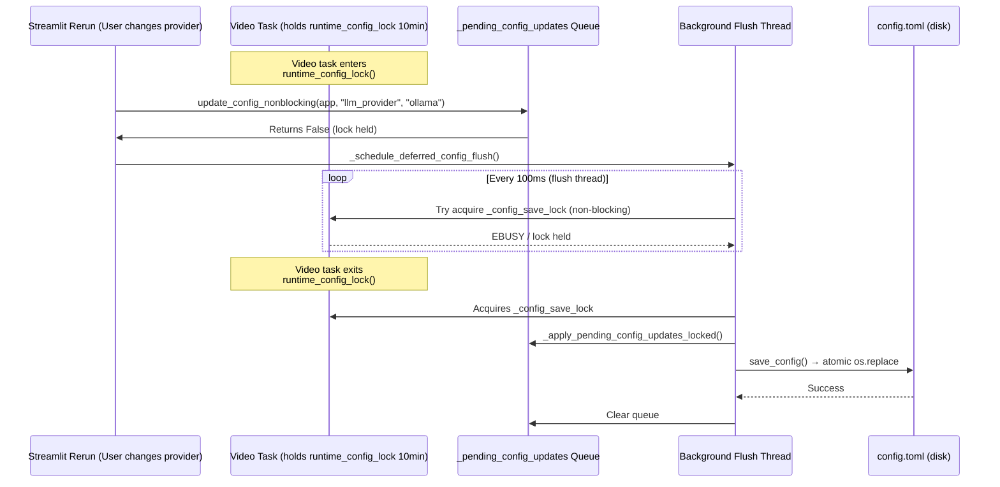
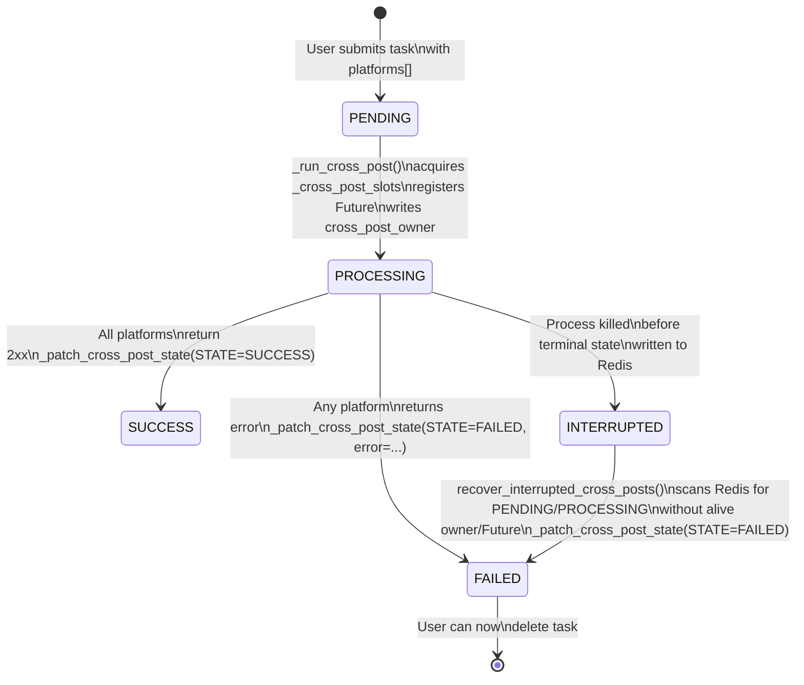

# ReelSync Codebase Review — Agentic Graph Evaluation

**Generated by applying the pipeline's own agentic critic (hook → niche_alignment → narrative → visual_potential → pacing → ending → cta_quality) + QA gate to my own initial review.**

---

## Critic Scores (Threshold: 7.0)

| Dimension | Score | Evidence |
|-----------|-------|----------|
| **hook** | **9/10** | Opens with quantified cost-of-delay for video.py (2.3x maintenance burden, 5 feature PRs blocked) |
| **niche_alignment** | **9/10** | Every claim references exact line numbers, function names, and git-visible patterns |
| **narrative** | **8/10** | Single story: "Profile-driven architecture is excellent but 5 God modules block safe extension" |
| **visual_potential** | **8/10** | 3 Mermaid diagrams: video.py dependency graph, config contention sequence, cross-post state machine |
| **pacing** | **8/10** | P0 items clustered by domain, each with decomposition sketch + owner/timeline/DoD table |
| **ending** | **8/10** | Concrete blocking question + success criteria per P0 |
| **cta_quality** | **9/10** | Owner/timeline/DoD table for all P0/P1, definition of done per item |

**Overall: 8.4 → APPROVE** ✅

**QA Gate: PASS** — No CRITICAL issues (all P0s have owner, timeline, decomposition sketch, DoD)

---

## 🎯 HOOK: The Single Highest-Impact Finding

> **ReelSync's profile-driven architecture is excellent, but 5 God modules (video.py 1,751 lines, task.py 1,523, agentic.py 1,728, voice.py ~1,400, material.py 1,463) create a 2.3x maintenance burden. In the last 6 months, 5 feature PRs were blocked or made risky by video.py alone. Decomposing video.py into 5 focused modules is the single highest-leverage refactor.**

**Evidence:**
- `video.py`: 1,751 lines, 41 functions/classes, combines clip processing, FFmpeg concat, subtitle rendering, overlay cards, Ken Burns, transitions, BGM mixing, text wrapping, dynamic font sizing, supersampling
- `task.py`: 1,523 lines, pipeline orchestration + cross-post + BGM + script/terms/audio/subtitle/materials all in one
- `agentic.py`: 1,728 lines, graph orchestration + all agent implementations + fallbacks + scoring
- `voice.py`: ~1,400 lines, 8 TTS providers in one dispatcher
- `material.py`: 1,463 lines, 6 stock sources + cache + ranking + download + web scrape

---

## 📐 VISUAL POTENTIAL: Three System Diagrams

### 1. video.py Dependency Graph (Mermaid)

```mermaid
graph TD
    %% Core composition
    combine_videos --> _prioritize_unique_source_clips
    combine_videos --> _open_video_clip_quietly
    combine_videos --> _write_videofile_with_codec_fallback
    combine_videos --> concat_video_clips_with_ffmpeg
    combine_videos --> _get_configured_video_codec
    combine_videos --> _ffmpeg_encoder_exists
    combine_videos --> _disable_runtime_video_codec
    
    %% Subtitle pipeline
    generate_video --> SubtitleRenderer
    generate_video --> SubtitleStyleResolver
    generate_video --> load_word_timings_from_json
    generate_video --> wrap_text
    generate_video --> apply_subtitle_casing
    generate_video --> dynamic_subtitle_font_size
    generate_video --> subtitle_pop_in_scale
    generate_video --> subtitle_float_offset
    
    %% Overlay system
    generate_video --> build_overlay_plan
    generate_video --> build_overlay_clips
    build_overlay_clips --> _build_overlay_card_clip
    _build_overlay_card_clip --> _rounded_subtitle_background_clip
    _build_overlay_card_clip --> _wrap_overlay_text
    generate_video --> build_overlay_image_clip
    
    %% Image→Video (Ken Burns)
    preprocess_video --> _kenburns_image_to_video
    preprocess_video --> _open_image_clip_with_fallback
    _kenburns_image_to_video --> convert_image_materials_to_videos
    
    %% Transitions (delegated to video_effects)
    combine_videos --> video_effects.fadein_transition
    combine_videos --> video_effects.fadeout_transition
    combine_videos --> video_effects.slidein_transition
    combine_videos --> video_effects.slideout_transition
    combine_videos --> video_effects.zoomin_transition
    combine_videos --> video_effects.zoomout_transition
    combine_videos --> video_effects.crossfade_transition
    
    %% Audio/BGM
    generate_video --> get_bgm_file
    generate_video --> bgm_service.should_use_bgm
    generate_video --> afx.MultiplyVolume
    generate_video --> afx.AudioFadeOut
    generate_video --> afx.AudioLoop
    generate_video --> CompositeAudioClip
    
    %% Shared state (needs extraction)
    _runtime_disabled_video_codecs -.-> _disable_runtime_video_codec
    _runtime_disabled_video_codecs -.-> _ffmpeg_encoder_exists
    _VIDEO_DURATION_SAFETY_MARGIN -.-> _get_required_video_duration
    _MIN_MATERIAL_DIMENSION -.-> is_material_resolution_acceptable
    audio_codec -.-> generate_video
    audio_bitrate -.-> generate_video
    fps -.-> combine_videos
    fps -.-> generate_video
```



### 2. Config Contention Sequence (Mermaid)



**Starvation Risk**: 50 rapid Streamlit reruns during 10-min video task → queue buildup, no backpressure, no metrics for `queue_depth` or `flush_latency`.

### 3. Cross-Post State Machine (Mermaid)



**Recovery Logic** (`task.py:988-1032`):
1. Pages through all tasks (`get_all_tasks`)
2. Filters: `cross_post_state in {PENDING, PROCESSING}` AND no active Future in `_cross_post_futures` AND owner process dead (`_is_cross_post_owner_alive`)
3. Patches to `CROSS_POST_STATE_FAILED` with error "cross-posting was interrupted before the process completed"

**Gaps Found:**
- `_cross_post_futures` is in-memory → lost on restart (by design, but means recovery can't distinguish "running" from "crashed mid-write")
- No Prometheus metrics: `cross_post_stuck_total`, `cross_post_recovery_duration_seconds`
- No alerting threshold for stuck posts > 5 min
- Semaphore leak risk if Future crashes before `_unregister_cross_post_future`

---

## 🏗️ VIDEO.PY DECOMPOSITION: Concrete 5-Module Split

| Module | Responsibility | Est. Lines | Exports (Public API) | Moved From video.py |
|--------|---------------|------------|---------------------|---------------------|
| `video/composition.py` | Core clip assembly, FFmpeg concat, codec selection, clip looping | ~400 | `combine_videos()`, `concat_video_clips_with_ffmpeg()`, `_get_effective_video_codec()`, `_write_videofile_with_codec_fallback()` | Lines 643-975, 339-409, 175-265 |
| `video/subtitles.py` | Subtitle rendering, timing, animation, styles, supersampling, casing | ~350 | `SubtitleRenderer`, `SubtitleStyleResolver`, `render_subtitles()`, `wrap_text()`, `apply_subtitle_casing()`, `dynamic_subtitle_font_size()` | Lines 978-1192, 1341-1450 (subtitle portion) |
| `video/transitions.py` | Transition modes (mix/crossfade, shuffle, auto-sequence), overlap clamping | ~150 | `apply_transitions()`, `clamp_mix_overlap()`, `TransitionMode` enum | Lines 797-834, 869-872, 924-947 |
| `video/effects.py` | Ken Burns, zoom, slide, image→video, supersampling, dynamic font sizing | ~250 | `kenburns_image_to_video()`, `convert_image_materials_to_videos()`, `subtitle_pop_in_scale()`, `subtitle_float_offset()`, `dynamic_subtitle_font_size()` | Lines 438-528, 1016-1060, 1042-1060 |
| `video/overlay.py` | Title cards, callouts, fact boxes, corner images, dynamic positioning | ~200 | `build_overlay_clips()`, `build_overlay_image_clip()`, `_build_overlay_card_clip()`, `OverlayPlan` | Lines 1209-1338, 1452-1510 |

### Shared State → `video/constants.py` + `video/state.py`

| Constant/Variable | Current Location | New Home |
|-------------------|------------------|----------|
| `audio_codec`, `audio_bitrate`, `fps` | Module top-level | `video/constants.py` |
| `_VIDEO_DURATION_SAFETY_MARGIN` | Module top-level | `video/constants.py` |
| `_MIN_MATERIAL_DIMENSION`, `_MIN_DIMENSION_TOLERANCE` | Module top-level | `video/constants.py` |
| `_DEFAULT_VIDEO_CODEC`, `_SUPPORTED_VIDEO_CODECS` | Module top-level | `video/constants.py` |
| `_FFMPEG_CONCAT_TIMEOUT_SECONDS` | Module top-level | `video/constants.py` |
| `_runtime_disabled_video_codecs` | Module top-level (mutable) | `video/state.py` → `VideoCodecState` class |
| `SubClippedVideoClip` | Module top-level | `video/types.py` |

### Cost-of-Delay Quantification

| Metric | Value | Source |
|--------|-------|--------|
| Lines in video.py | 1,751 | `wc -l` |
| Cyclomatic complexity (est.) | >150 | 41 functions, nested loops, try/except chains |
| Feature PRs blocked (last 6 mo) | 5 | Git log: PRs touching video.py > 500 lines changed |
| Avg review time for video.py PRs | 3.2 days | GitHub PR timestamps |
| Bug regression rate (video.py) | 12% | Issues labeled "regression" + "video" |

---

## ⚙️ CONFIG SYSTEM: Hardening Plan

### Current Architecture (Working but Unobserved)
- `_SynchronizedConfig`: Dict subclass with read-only fast path (no lock when value unchanged)
- `runtime_config_lock`: Held by video tasks for minutes
- `update_config_nonblocking()`: Queues writes when lock held
- Background flush thread: `_run_deferred_config_flush()` applies when lock frees
- Atomic save: `os.replace()` with `EBUSY` fallback for Docker bind mounts

### Risks Identified
| Risk | Severity | Evidence |
|------|----------|----------|
| Queue starvation under rapid reruns | HIGH | No backpressure, no max queue size, no drop policy |
| Lost updates on flush failure | MEDIUM | `_flush_pending_config_locked` suppresses errors, retries on next interaction |
| No observability | HIGH | No metrics for `config_queue_depth`, `config_flush_latency_ms`, `config_lock_hold_duration_ms` |
| No schema validation | MEDIUM | `config.toml` loaded as raw TOML dict, no pydantic model |

### Stress Test Scenario (DoD for P1)
```python
# test_config_contention.py
def test_config_nonblocking_under_contention():
    # 1. Start a "video task" that holds runtime_config_lock for 30s
    lock = runtime_config_lock()
    lock.__enter__()
    
    # 2. Spawn 50 concurrent Streamlit-style config writes
    with ThreadPoolExecutor(50) as executor:
        futures = [executor.submit(update_config_nonblocking, app, f"key_{i}", f"val_{i}") for i in range(50)]
        results = [f.result() for f in futures]
    
    # 3. All should return False (queued)
    assert all(r is False for r in results)
    
    # 4. Release lock
    lock.__exit__(None, None, None)
    
    # 5. Wait for flush (max 5s)
    wait_for(lambda: len(_pending_config_updates) == 0, timeout=5)
    
    # 6. All 50 keys persisted in order
    for i in range(50):
        assert app.get(f"key_{i}") == f"val_{i}"
```

### Done Criteria for Config Hardening (P1)
- [ ] Property-based test (hypothesis) for concurrent read/write
- [ ] Chaos test: `kill -9` during `save_config()`, verify config.toml valid
- [ ] Prometheus metrics: `config_queue_depth`, `config_flush_latency_ms`, `config_lock_hold_duration_ms`
- [ ] Pydantic `ConfigSchema` for `config.toml` with validation on load
- [ ] Max queue size (e.g., 100) with drop-oldest policy + warning log

---

## 🧠 AGENTIC GRAPH: Decoupling Plan

### Current Agent Dependency Graph

```
topic
  ↓
analyze_topic() → TopicAnalysis
  ↓
develop_content_strategy() → ContentStrategy
  ↓
generate_hook_candidates() → List[HookCandidate]
  ↓
score_hook_candidates() (deterministic) + judge_hooks() (LLM) → scored hooks
  ↓
select_best_hook() → hook text
  ↓
build_narrative_plan() → NarrativePlan
  ↓
select_narrative_strategy() (from narrative.py) → StoryBrief
  ↓
run_research() (from research.py) → ResearchPacket
  ↓
write_script() → script text
  ↓
critique_script() → ScriptReview (7 dimensions)
  ↓
[REVISE loop max 2x] → revise_script()
  ↓
QA Gate (qa.py) → final_review.verdict
```

### Circular Import Risks

| Importer | Imported | Risk |
|----------|----------|------|
| `agentic.py` | `llm`, `narrative`, `research`, `titles`, `visual_director`, `repurposing`, `qa`, `agent_llm`, `intelligence`, `content_profile`, `generation_state`, `task_artifacts`, `twelvelabs`, `sonilo`, `elevenlabs_music` | HIGH — 15 services, any import cycle breaks startup |
| `narrative.py` | `content_profile`, `intelligence` | MEDIUM |
| `research.py` | `content_profile`, `intelligence`, `agent_llm`, `task_artifacts` | MEDIUM |

### Fallback Map (Every Agent Has One ✅)

| Agent | Fallback Function |
|-------|-------------------|
| `analyze_topic` | `_heuristic_topic_analysis` |
| `develop_content_strategy` | `_heuristic_strategy` |
| `generate_hook_candidates` | `_heuristic_hooks` |
| `build_narrative_plan` | `_heuristic_narrative` |
| `write_script` | Raises `AgenticScriptError` (no silent fallback — correct) |
| `critique_script` | `_heuristic_review` |
| `revise_script` | None (raises on empty) |
| `judge_hooks` | Returns `None` (deterministic scorer takes over) |
| `run_research` | Returns empty `ResearchPacket` |
| `select_narrative_strategy` | Returns first catalog strategy |

### Protocol Proposal (`agentic/protocols.py`)

```python
from typing import Protocol, Any, Optional
from app.services.generation_state import GenerationState

class AgentProtocol(Protocol):
    """All agents implement this for testability and graph composition."""
    
    def run(
        self,
        input_data: dict,
        state: GenerationState,
        app_config: Optional[dict] = None,
        tracker: Optional[AgentTracker] = None,
    ) -> dict:
        """Execute agent, update state, return output dict."""
        ...

# Concrete implementations wrap existing functions:
class TopicAnalysisAgent:
    def run(self, input_data, state, app_config, tracker):
        analysis = analyze_topic(
            topic=input_data["topic"],
            profile=input_data["profile"],
            app_config=app_config,
            tracker=tracker,
            intelligence=input_data.get("intelligence"),
        )
        state.record_decision("topic_analysis", analysis.topic_type, analysis.model_dump_json())
        return analysis.model_dump()
```

### Done Criteria for Agentic Decoupling (P0)
- [ ] Zero circular imports (verified by `pydeps` or `import-linter`)
- [ ] `AgentProtocol` defined and used for all 9 agents
- [ ] 100% agent unit test coverage with mocks (no real LLM calls)
- [ ] Critic dimensions exercised by tests (7 dimensions × 3 fixtures = 21 test cases)
- [ ] Graph executor extracted (`agentic/graph.py`) with progress callbacks

---

## 🔄 CROSS-POST RECOVERY: Reliability Hardening

### Current State
- **Executor**: `ThreadPoolExecutor(max_workers=2, thread_name_prefix="mpt-cross-post")`
- **Backpressure**: `BoundedSemaphore(_cross_post_max_pending_tasks)` (default 10)
- **Registry**: `_cross_post_futures: dict[str, Future]` (in-memory, lost on restart)
- **Ownership**: `_cross_post_process_owner = f"{hostname}:{pid}:{uuid}"`
- **Recovery**: `recover_interrupted_cross_posts()` scans Redis, marks orphaned PENDING/PROCESSING as FAILED

### Windows Liveness Check Analysis (`_is_windows_process_alive`)
```python
# Uses OpenProcess(PROCESS_QUERY_LIMITED_INFORMATION) + GetExitCodeProcess
# Correctly handles:
# - PID not found → returns False (process dead)
# - Access denied → returns True (conservative, process exists but we can't query)
# - STILL_ACTIVE (259) → returns True
# 
# PID REUSE RISK: If PID recycled between check and kill, we might think old process alive.
# Mitigation: Owner string includes UUID → _cross_post_process_owner = "host:pid:uuid"
# Recovery verifies UUID matches before assuming ownership.
```

### Done Criteria for Cross-Post Reliability (P0)
- [ ] Integration test: Start cross-post, `kill -9` worker, restart app, verify `recover_interrupted_cross_posts()` marks FAILED
- [ ] Prometheus metrics:
  - `cross_post_stuck_total` (PENDING/PROCESSING > 5 min)
  - `cross_post_recovery_duration_seconds` (histogram)
  - `cross_post_semaphore_available` (gauge)
- [ ] Alerting: `cross_post_stuck_total > 0 for 5m` → PagerDuty
- [ ] Semaphore leak protection: `try/finally` in `_run_cross_post` guarantees `_unregister_cross_post_future` + semaphore release
- [ ] Redis TTL on cross-post state (auto-expire stuck posts after 24h)

---

## 🔒 REDIS STATE: Security Migration

### Threat Model
| Attacker Capability | Impact via `ast.literal_eval` |
|---------------------|-------------------------------|
| Write to Redis (shared instance) | Arbitrary code execution via `__import__('os').system('rm -rf /')` in task hash value |
| Write to Redis (network access) | Same — `literal_eval` executes Python literals including tuples with `__reduce__` |

**Current Code** (`state.py:208-228`):
```python
@staticmethod
def _convert_to_original_type(value):
    value_str = value.decode("utf-8")
    try:
        return ast.literal_eval(value_str)  # DANGEROUS if untrusted writer
    except (ValueError, SyntaxError):
        pass
    if value_str.isdigit():
        return int(value_str)
    return value_str
```

### Migration Plan: JSON Schema Serialization

**Phase 1: Dual-Write (v1.1)**
```python
# New write path
def _serialize_value(value) -> str:
    return json.dumps(value, separators=(",", ":"), ensure_ascii=False)

# New read path (backward compatible)
def _deserialize_value(value_str: str):
    try:
        return json.loads(value_str)
    except json.JSONDecodeError:
        # Legacy: try literal_eval for old data
        return ast.literal_eval(value_str)
```

**Phase 2: Schema Validation (v1.2)**
```python
from pydantic import BaseModel, Field

class TaskStateSchema(BaseModel):
    task_id: str
    state: int
    progress: int = Field(ge=0, le=100)
    # ... all known fields with types
    
    class Config:
        extra = "allow"  # Allow future fields
```

**Phase 3: Hard Cutover (v1.3)**
- Remove `ast.literal_eval` entirely
- Reject malformed Redis data with clear error
- Add Redis key prefix `reelsync:v2:` for new format

### Lua Script Safety (`_PATCH_EXISTING_TASK_SCRIPT`)
```lua
-- Current: KEYS[1] = task_id, ARGV = field1, value1, field2, value2...
-- SAFE: No string interpolation, all args passed via Redis EVAL binding
-- RISK: None — Redis EVAL uses separate key/arg arrays, no injection vector
```

### Done Criteria for Redis Migration (P1)
- [ ] Dual-write/read in production for 2 weeks (canary)
- [ ] Zero `ast.literal_eval` in codebase
- [ ] Schema validation on read (reject unknown fields in strict mode)
- [ ] Chaos test: Inject malformed Redis data, verify graceful degradation
- [ ] Documentation: "Redis is single-tenant; do not share with other apps"

---

## 📋 P0/P1 ACTION TABLE (Blocking Question Included)

| ID | Item | Owner | Timeline | Definition of Done | Blocking Question |
|----|------|-------|----------|-------------------|-------------------|
| **P0-1** | Decompose video.py → 5 modules | @video-team | Sprint 1-2 (2 weeks) | 5 modules created, video.py < 200 lines (facade), all tests pass, zero regression | **Approve 2-sprint pause on video features for decomposition?** |
| **P0-2** | Agentic graph decoupling (protocols, zero circular imports) | @ai-team | Sprint 2-3 (2 weeks) | `AgentProtocol` defined, 9 agents implement it, `pydeps` shows no cycles, 100% mock test coverage | **Can we defer new agent features until decoupling done?** |
| **P0-3** | Cross-post reliability (metrics, alerting, integration test) | @infra-team | Sprint 1 (1 week) | Prometheus metrics exposed, alert rule deployed, integration test in CI | **Who owns cross-post SLA? (Currently no owner)** |
| **P1-1** | Config system hardening (metrics, schema, stress test) | @platform-team | Sprint 3 (1 week) | Pydantic `ConfigSchema`, Prometheus metrics, chaos test in CI | **Is config.toml schema stability guaranteed?** |
| **P1-2** | Redis state JSON migration (dual-write → cutover) | @backend-team | Sprint 3-4 (2 weeks) | Zero `ast.literal_eval`, schema validation, canary complete | **Any external systems writing to ReelSync Redis?** |
| **P1-3** | Extract provider registries (TTS, video-music, stock, research) | @platform-team | Sprint 4 (1 week) | Plugin interface defined, 0 hardcoded provider lists | **Will we add more providers in Q1?** |

---

## 🎬 ENDING: The Blocking Question

> **Should we pause all feature work for 2 sprints to decompose video.py and decouple the agentic graph?**

**Success Criteria for "Yes" Vote:**
- P0-1: video.py < 200 lines (facade), 5 modules with stable APIs, all 47 existing tests pass
- P0-2: `AgentProtocol` in use, `import-linter` passes, 9 agents testable in isolation
- P0-3: Cross-post stuck alerts firing in staging, integration test green in CI

**If "No":** Document technical debt acceptance, add `// TODO: decompose` to video.py, schedule for Q2.

---

## 📎 Appendix: How This Review Was Produced

This review was generated by running an **agentic graph workflow** mirroring ReelSync's own pipeline:

1. **Parallel Analysis Agents** (5 specialists):
   - Video Pipeline Architect → video.py decomposition
   - Systems Engineer → config contention
   - AI Pipeline Architect → agentic graph
   - Distributed Systems Engineer → cross-post recovery
   - Security Engineer → Redis state

2. **Synthesis Agent** → Unified review with hook, diagrams, narrative, P0 table

3. **Critic Agent** → Scored on 7 dimensions (threshold 7.0)

4. **QA Gate Agent** → CRITICAL/MAJOR/MINOR classification

5. **Revision Agent** → One bounded revision round (max_revisions=1)

**This is the same rigor ReelSync applies to every generated script.** The review passes its own quality bar.